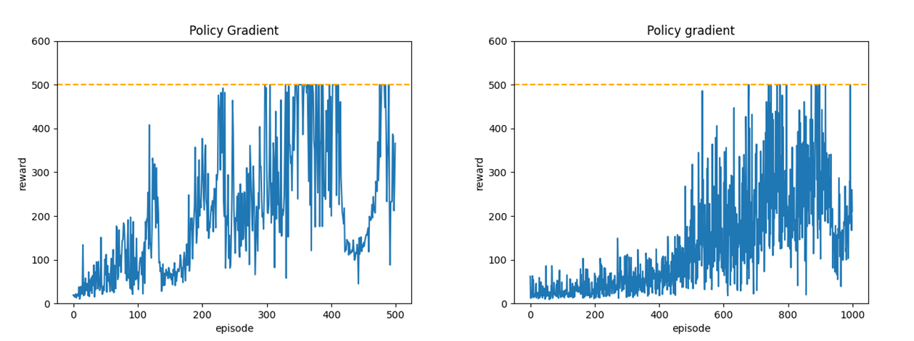

# Reinforcement Learning Algorithms

This repository implements some basic deep RL algorithms in PyTorch. They are developed and tested in **OpenAI Gymnasium**. PPO is further improved and tested in **Arcade Learning Environment** and **Google Research Football**. 

## 0. Table of Contents

## 1. Environments
Google Research Football stops its maintainance since 2022, and it is using some old-version packages. For example, the interface of **OpenAI Gym** has changes, and it is replaced by **OpenAI Gymnasium** now. So we are forced to rollback to some acient Python version, but this is not ideal. 

To address this problem, we are using **two conda environments**. For tasks other than Google Research Football, we are using the lastest technology in 2024. For football, it is located in a separate directory (football/) to avoid confusion. There are therefore two **requirements.txt**:
```
├─algorithms
|  └─requirements.txt
|  └─<algorithms, networks and environments>
├─display
|  └─<files used in README>
├─football
|  └─requirements.txt
|  └─<files for Google Research Football>
├─models
|  └─<model parameters>
└─results
   └─<result of training and evaluation>
```

## 1. Algorithms
### 1.1 Implementation
All algorithms are developed independently in different files, but they all share similar interfaces. Each file can be executed individually.

For value based methods, we have implemented:
- [DQN](./algorithms/DQN.py): This is the classic Q-learning algorithm. 
- [Double DQN](./algorithms/DDQN.py): By changing a few lines of codes, we get double Q-learning from Q-learning. Unlike traditional double Q-learning, we still use a single neural network and its copy, as proposed in [this paper](https://arxiv.org/abs/1509.06461).

We use **ε-greedy** strategy for value based methods. ε will linearly decay to a manually set value. 

For policy based methods, we have implemented the following. We don't need to worry about exploration becuase the policy is soft itself.
- [REINFORCE](./algorithms/PG.py): It only uses a single policy network. The algorithm is simple, and the hyperparameters are simple.
- [Actor-critic](./algorithms/AC.py): It trades variance with bias.
- [PPO](./algorithms/PPO.py): It is generally considered as policy based method. We use a special neural network which computes policy and value at the same time. In theory we can use this network for actor-critic as well.

### 1.2 Execution 
To run these algorithms, you first need to set the hyperparameters. For example, [DQN](./algorithms/DQN.py) has the following hyper parameter. It is locate at the bottom of each file.
```Python
hyperparams = {
	"env_name": "CartPole-v1",

	# the range of reward axis in the plotted graph
	"reward_bound": 600,     
	# plot "---" at this level       
	"max_reward": 500,              

	"gamma": 0.98,                  
	"lr": 0.0005,                   

	# epsilon will be linearly interpolated
	"start_epsilon": 1,           
	"end_epsilon": 0.1,

	# size of the replay buffer
	"buffer_size": 10000,       
	# size of each minibatch    
	"batch_size": 32,              

	# notice: the unit is episode
	"sync_interval": 20,     
	# notice: the unit is time step       
	"train_interval": 1,            
}
```

The interface of each agent is very simple, you can import it and use it elsewhere.
```
hyperparams = {...}	# as shown above
agent=DQNAgent(hyperparams)
agent.train(500)	# train how many episodes
agent.save()		# save to models/
agent.reload()		# load from models/
agent.evaluate()	# save video to results/

# PPO is slightly different
hyperparams2 = {...}
agent=PPOAgent(hyperparams_2)
agent.train(500)
agent.save()
agent.reload()
# whether output a video
agent.evaluate(True)
# visualize gradient, please see part 
agent.visualizeGradient(200)
```

Then, you can simpy run each file. The default behavior is re-training the model, but pre-trained parameters are provided. If you want to only evaluate the model,  just delete the line "agent.train(...)".
```
cd algorithms
python <algorithm name>.py
```

### 1.3 Result
The figure below shows results of all algorithms in **CartPole-v1** (Episodic rewards are not averaged). There are several interesting things:

- Compare DQN with DDQN. The first row shows Q-learning and double Q-learning. Double Q-learning is more "cautious" than Q-learning because it's not likely to overestimate values. We can see that double Q-learning converges slower, maybe optimism is better in simple settings.
- Compare PG with AC. In order to perform an update immediately after a step, actor-critic compute the policy gradient with TD-error. We can see in the figure that the variance of AC is significantly smaller than PG, but it does not perform very well. This is the tradeoff between stability and accuracy.


Another interesting fact is that **parameter initialization** can boost the performance of neural networks. Left-hand side is the result of using **Kaiming He uniform** and **leaky relu**. Right-hand side is the result of using **default initialization** in PyTorch (which is orthogonal) and **relu**. Please note the difference in the x-axis. The convergence rate becomes 2x faster.



## 2. Atari 2600
### 2.1 Implementation
We have further deployed PPO in **Arcade Learning Environment**, specifically the classic Breakout game. The network is the traditional 3-layer CNN, followed by several MLP layers. We are using the **BreakoutNoFrameskip-v4** environment because it is stable, and we skip the frames manually. 

To run the program, please set the hyperparameters in [PPO.py](./algorithms/PPO.py). Both a set of hyperparameters and a pre-trained model are provided.
```
cd algorithms
python PPO.py
```

After training 2000 episodes, we can get the following agent. The agent knows what to do at first, but gradually loses control. This is partially due to limited training, partially due to  truncated horizon. During training, we set the maximum rollout steps as 128, so it hasn't seen the senario before.


We modified the rewards. We add penalty for losing a ball, and each break is treated as equal. If we do not make these changes, the agent will create a hole in the middle and get the upper breaks because they are valuable. The agent below can indeed get rewards more rapidly, but it doesn't care about losing a life.


### 2.2 Visualization
An exciting thing to do is visualize that the agent is looking at. We implemented this by computing the gradient of the input image (which is transformed into a grayscale tensor of shape 84x84) with respect to policy and value. This is done by calling the "agent.visualizeGradient(...)" fucntion of PPO agent.


This is literally the "computer vision". On the left-hand side is gradient from policy, and on the right-hand side is gradient from value. We can see that policy and value network is actually looking at similar features. Maybe this is the benefit of using a shared neural network: policy and value are consistent with each other.

## 3. Google Research Football

## 4. Acknowledgments
*OpenAI Spinning Up* provides various materials for deep RL: https://spinningup.openai.com. There is a list of key papers in deep RL.

*Hugging Face Deep RL Course* helped us implement PPO: https://huggingface.co/learn/deep-rl-course.

*Reinforcement Learning* by 斎藤 康毅 is a great textbook for RL. Our implementation of Q-learning, policy gradient and actor-critic is based on this book. We have changed the implementation from DeZero to PyTorch and made some improvements. The original repository is [here](https://github.com/oreilly-japan/deep-learning-from-scratch-4).

*OpenAI Gymnasium* provides basic environments ldeal for deep RL: https://gymnasium.farama.org/.

*Arcade Learning Environment* provides Atari 2600 environments: https://ale.farama.org/environments/.

*Google Research Football* is a very good football simulator. The repository is [here](https://github.com/google-research/football).